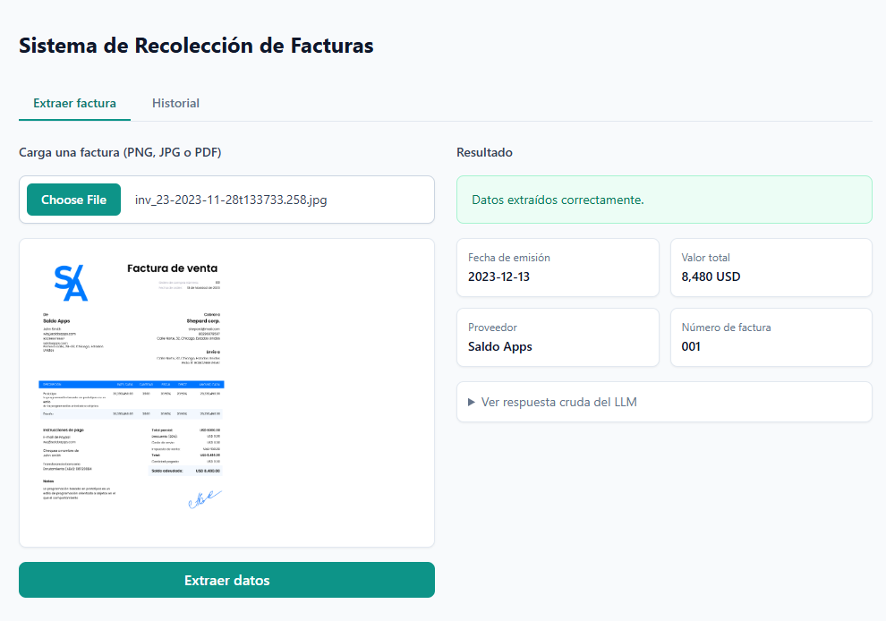
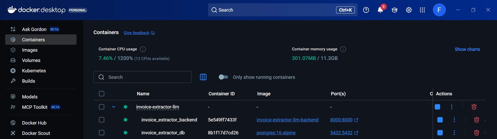
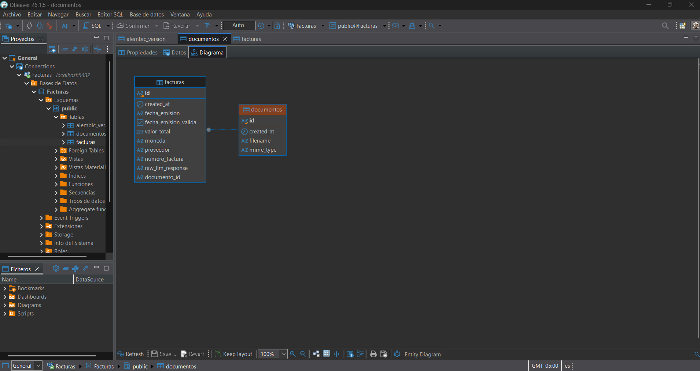

# invoice-extractor-llm

An application that lets you upload a service invoice (image or PDF), extract
its key data using a vision-capable LLM, and view it in a web interface.
Architecture: **FastAPI backend + PostgreSQL** (SQLAlchemy 2.0 async +
Alembic) and **React + Vite frontend**, in a monorepo.

## Screenshots

**Web interface** — upload an invoice, get the structured fields back:



**Running in Docker** — backend + PostgreSQL as separate containers:



**Database schema** (`documentos` → `facturas`, viewed in DBeaver) — fulfills
the technical test's "Plus: SQL database integration":



## Extracted data

- **Issue date** (normalized to `YYYY-MM-DD`) — required
- **Total amount due** — required
- Currency, provider/issuer, and invoice number — optional, they don't break
  the flow if the model can't identify them (they come back as `null`)

## Project structure

```
invoice-extractor-llm/
├── backend/                       # FastAPI API
│   ├── main.py
│   ├── requirements.txt
│   ├── Dockerfile
│   ├── alembic/                    # migrations (version the `documentos`/`facturas` schema)
│   └── src/
│       ├── core/                    # config (pydantic-settings), DB connection (SQLAlchemy async)
│       ├── llm/                     # clients.py (litellm), schema.py, extractor.py
│       ├── prompts/                 # system_prompt.md, user_prompt.md, correction_prompt.md
│       ├── models/                  # base.py (mixin), documento.py (`documentos`), invoice.py (`facturas`)
│       ├── schemas/                 # invoice.py — Pydantic API input/output schemas
│       ├── services/                # documento_service.py, invoice_service.py — database queries
│       └── routers/                 # invoice_router.py — HTTP endpoints
├── frontend/                       # React + Vite + TypeScript + Tailwind SPA
│   └── src/
│       ├── lib/api.ts               # axios client
│       ├── components/              # ExtractView, HistoryView
│       └── App.tsx
├── docker-compose.yml               # Postgres + backend
├── .env / .env.example
└── docs/
    ├── examples/                      # sample invoices to test the app with
    └── images/                        # screenshots used in this README
```

Organized **by technical layer** (not by domain/feature): since the project
only has one resource (invoices), each folder groups files of the same kind
(all models in `models/`, all schemas in `schemas/`, etc.) instead of one
folder per feature.

## Setup and running

### 1. Environment variables

Copy `.env.example` to `.env` at the repo root and fill in:

- `LLM_PRIMARY`: the primary model, as `"provider/model"` (see
  `backend/src/llm/clients.py`). Defaults to `gemini/gemini-3.5-flash`. The
  model call goes through [litellm](https://github.com/BerriAI/litellm),
  which supports OpenAI, Gemini, and many other providers under one API.
- `GEMINI_API_KEY`: your Google AI Studio key. No key is hardcoded — litellm
  reads the right API key env var based on the provider prefix in the model
  string (`gemini/...` → `GEMINI_API_KEY`, `openai/...` → `OPENAI_API_KEY`).
- `LLM_FALLBACK` (optional): if the primary model fails (service down, API
  error, etc.), litellm automatically retries with this model before giving
  up. Defaults to `openai/gpt-4o` — remember to also set `OPENAI_API_KEY` so
  the fallback actually works. Leave it empty to disable it.
- The Postgres variables (`POSTGRES_USER`, `POSTGRES_PASSWORD`,
  `POSTGRES_DB`, `DATABASE_URL`) already ship with defaults that work as-is
  with `docker-compose.yml` — you can change them, but `DATABASE_URL` must
  always match the other three (same username, password, and database name).

### 2. Backend + database (Docker)

```bash
docker compose up --build
```

This starts Postgres, runs the Alembic migrations automatically, and starts
the API at `http://localhost:8000` (with hot reload). Check that it's up:

```bash
curl http://localhost:8000/health
```

Interactive API docs (Swagger): `http://localhost:8000/docs`.


### 3. Frontend

```bash
cd frontend
npm install
npm run dev
```

Open `http://localhost:5173`. The frontend is already configured
(`.env.local`) to point to `http://localhost:8000`.

### 4. Using the app

1. **"Extract invoice"** tab: upload a PNG, JPG, or PDF, click "Extract data",
   and you'll see the structured fields + the LLM's raw JSON.
2. **"History"** tab: lists every processed invoice, read directly from
   PostgreSQL.

At least one sample invoice (real or fictitious) ships in `docs/examples/`
for testing the upload/extraction flow.

## API

| Method | Route                       | Description                                   |
| ------ | --------------------------- | ---------------------------------------------- |
| POST   | `/api/v1/invoices/extract`  | Uploads an invoice (`multipart/form-data`, `file` field), extracts it, and persists it |
| GET    | `/api/v1/invoices`          | Invoice history (most recent first) |
| GET    | `/api/v1/invoices/{id}`     | Invoice detail, including the LLM's raw JSON |
| GET    | `/health`                   | Health check |

## Technical decisions

**Separate backend/frontend architecture**
A REST backend + SPA splits responsibilities in an industry-standard way:
the backend is reusable by any client (web, mobile, CLI), and the frontend
can evolve independently. It's kept as a monorepo (`backend/` + `frontend/`)
for simplicity, since it's a single developer shipping both pieces as one unit.

**PostgreSQL + SQLAlchemy 2.0 async + Alembic**
`asyncpg` + SQLAlchemy async avoids blocking FastAPI's event loop on every
query; Alembic versions the database schema instead of relying on
`CREATE TABLE IF NOT EXISTS`, which is the standard practice for evolving a
schema over time without losing data.

**`extract_invoice_data` runs in a threadpool**
`litellm.completion` is synchronous. To avoid blocking FastAPI's async event
loop while waiting for the LLM's response, the router calls it via
`fastapi.concurrency.run_in_threadpool`.

**Why direct vision instead of OCR?**
The image (or the PDF's first page, rendered to an image with PyMuPDF) is
sent directly to the vision-capable model, with no intermediate OCR step
that could introduce transcription errors and lose the document's spatial
layout (useful for the model to understand tables and invoice layouts).

**Prompts live in `src/prompts/` (`.md` files)**
`system_prompt.md`, `user_prompt.md`, and `correction_prompt.md` are the
single source of truth for what gets sent to the LLM — `llm/extractor.py`
reads them at import time instead of hardcoding the text as Python string
constants. Editing a prompt is a content change, not a code change.

**How is the LLM's JSON validated?**
1. The system prompt (`system_prompt.md`) asks the model to respond
   **exclusively** with a JSON object matching a fixed schema.
2. The response is parsed (`json.loads`, stripping any ```json fences) and
   validated against a **Pydantic** model (`llm/schema.py: InvoiceExtraction`).
3. If parsing or validation fails, **one retry** is made, sending the model
   the error it produced and explicitly asking it to fix the format.
4. If the second attempt also fails, the endpoint returns `422` with the
   error — the failed extraction is **not persisted** — without the API
   crashing.
5. The date is normalized separately with `dateutil.parser` to `YYYY-MM-DD`;
   if it can't be parsed, it's stored as-is and flagged with
   `fecha_emision_valida = false` instead of failing silently.

**Provider abstraction via litellm (`llm/clients.py`)**
`call_llm()` wraps `litellm.completion()`, which unifies OpenAI, Gemini, and
many other providers behind one OpenAI-style message API — including native
image (vision) input and JSON-mode output. The model to call is just a
`"provider/model"` string (`LLM_PRIMARY`), so switching providers is a config
change, not a code change.

**Automatic provider fallback**
If `LLM_FALLBACK` is set, litellm retries the same request with that model
whenever the primary one fails (API error, service outage, etc.) — this
happens transparently inside a single `call_llm()` call. `extract_invoice_data`
(`llm/extractor.py`) only adds its own retry on top of that, for the separate
case of the LLM returning invalid JSON.

**`facturas` table (previously `invoices`)**
The SQLAlchemy model in `models/invoice.py` uses `__tablename__ = "facturas"`.
The API endpoints stay under the `/api/v1/invoices` prefix (the HTTP route
name and the database table name are independent of each other — renaming
one doesn't require renaming the other).

**`documentos` → `facturas` (two related tables, not one)**
`documentos` holds the uploaded file's own data (`filename`, `mime_type`);
`facturas` holds the data extracted from it (`fecha_emision`, `valor_total`,
etc.) and points back to its `documento` via a foreign key
(`documento_id`). This separates "what was uploaded" from "what the LLM
extracted from it" — useful if a document is ever reprocessed, or if the
extraction later grows to store multiple attempts per document. `Invoice`
exposes `filename` as a Python `@property` that reads through to
`self.documento.filename`, so the API response shape didn't need to change
when the column moved tables — `InvoiceService.list_invoices`/`get_by_id`
eager-load the relationship (`selectinload`) so that property never triggers
a lazy DB call outside of an active session.
